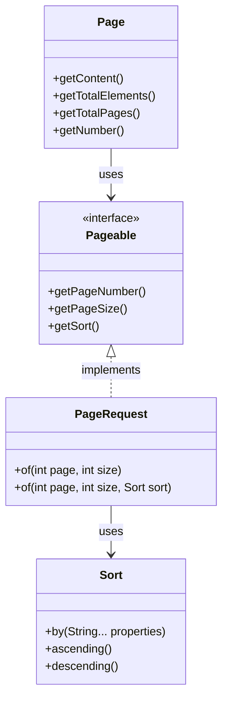

# Pagination

## Links & Intro

- [AlbertProfe&#39;s list / userBorrowBook · GitHub](https://github.com/stars/AlbertProfe/lists/userborrowbook)
- [GitHub - AlbertProfe/BooksPageable](https://github.com/AlbertProfe/BooksPageable)
- https://spring.io/projects
- [Defining Query Methods :: Spring Data JPA](https://docs.spring.io/spring-data/jpa/reference/repositories/query-methods-details.html#repositories.special-parameters)

## About handling large results

`Spring Data` provides powerful features for <mark>handling large result sets</mark> through `paging`, `sorting`, and `limiting`. 

The infrastructure recognizes specific types like `Pageable`, `Sort`, and `Limit` to dynamically apply these operations to queries.

Pagination can be implemented using the Page<T> or Slice<T> return types:

- **Page<T>** provides information about the total number of elements and pages, but requires an additional count query. 
- **Slice<T>** is more efficient as it only indicates if there's a next page available.

**Sorting**

`Sorting` can be applied using the `Sort` parameter or through the `Pageable` instance. Limiting results can be achieved using the `Limit` parameter or by using the First or Top keywords in method names.

**Query structure: List or Stream?**

When choosing a method to consume large query results, developers should consider the amount of data fetched and query structure:

- **List<T> and Streamable<T>** fetch all results in a single query but <mark>risk memory exhaustion. </mark>
- **Stream<T> and Flux<T>** fetch data in chunks, which is more <mark>memory-efficient</mark> but requires proper resource management.

**Repositories**

To implement `pagination`, repositories should extend `PagingAndSortingRepository`. `PageRequest` objects can be created with page number, size, and sorting criteria. For sorting, developers can specify sort direction and fields.

> When dealing with large datasets, choosing the appropriate method (Page, Slice, Stream, or Flux) depends on the specific requirements of the application and the nature of the data being queried.

## Key concepts

Page, Pageable, and PageRequest in Spring Data JPA:

| Concept     | Description                   | Key Features                                                                                                                              |
| ----------- | ----------------------------- | ----------------------------------------------------------------------------------------------------------------------------------------- |
| Page        | Container for paginated data  | - Holds subset of data<br>- Contains actual content (list of items)<br>- Provides metadata (total elements, total pages, current page)    |
| Pageable    | Interface for pagination info | - Defines pagination parameters<br>- Specifies page number and size<br>- Includes sorting criteria<br>- Used in repository methods        |
| PageRequest | Implementation of Pageable    | - Creates Pageable objects<br>- Specifies page number, size, and sorting<br>- Example: PageRequest.of(0, 10, Sort.by("name").ascending()) |



## Code

```java
@Repository
public interface BookRepository extends PagingAndSortingRepository<Book, String> {}


@Service
public class BookService {

@Autowired
private BookRepository bookRepository;

public Page<Book> findPaginated(int pageNo, int pageSize) {

    Pageable pageable = PageRequest.of(pageNo , pageSize);

return bookRepository.findAll(pageable);
}
```

> This service provides a simple way to retrieve books in a paginated manner, which is useful for displaying large sets of data in smaller chunks, like in a web interface with multiple pages of results.

Explanation:

1. `@Service`: This annotation marks the class as a service component in Spring's component scanning.
2. `@Autowired private BookRepository bookRepository`: This injects the BookRepository into the service, allowing us to use its methods.
3. `public Page<Book> findPaginated(int pageNo, int pageSize)`: This method provides paginated access to the books.
4. `Pageable pageable = PageRequest.of(pageNo, pageSize)`: This creates a Pageable object, which encapsulates pagination information (page number and page size).
5. `return bookRepository.findAll(pageable)`: This calls the findAll method on the repository, passing the Pageable object. It returns a Page<Book> containing the requested subset of books.

## How it works

- [data.sql at master userBorrowBookPagination · GitHub](https://github.com/AlbertProfe/userBorrowBookPagination/blob/master/userBorrowBookPagination/src/main/resources/data.sql)

> For example, with our books sets of data (20 `books`). Let's explore what happen when we  call `findPaginated(0, 5)`

The pagination system in Spring Data JPA doesn't hold the entire result set in memory. Instead, it uses database-level pagination<mark> to fetch only the requested page of results</mark>. Here's how it works:

1. When we call `findPaginated(0, 5)`, Spring Data JPA translates this into a database query tha t**fetches only the first 5 records.**

2. The database executes this query and returns **only the requested page of results.**

3. Spring Data JPA wraps these results in a `Page` object, which contains:
   
   - The **requested page of data (5 books in this case)**
   - **Metadata** about the pagination (total number of pages, total number of elements, etc.)

4. The `Page` object is then returned to our application.

5. Subsequent calls for different pages (e.g., `findPaginated(1, 5)` for the second page) <mark>will trigger new database queries to fetch the specific page requested.</mark>

> Spring Data JPA's pagination system **can handle datasets with over 1 billion rows,** ensuring efficient data navigation without overwhelming system [memory](https://www.linkedin.com/pulse/mastering-spring-data-jpa-pagination-sorting-custom-queries-lolage-fya0f). 
> 
> The application itself only holds the **current page of results in memory**, not the entire dataset or all pages.
